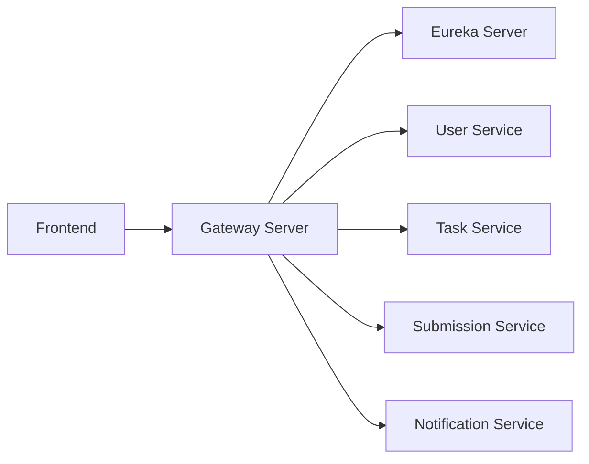

# 🚀 Team Task Management Software

<div align="center">


*A modern microservice-based task management solution for teams*

</div>

## 📋 Overview

**Team Task Management Software** is a robust application designed to streamline task management within teams, facilitating seamless interaction between administrators and users. Leveraging a **modern microservice architecture**, this application empowers administrators with comprehensive tools for task assignment, monitoring, and review, while providing users with an intuitive platform to track, complete, and submit their work.

## ✨ Key Features

### 👨‍💼 For Administrators

* **📝 Task Creation & Management**
  * Create, edit, and manage tasks with detailed information
  * Include title, description, tags, images, and deadlines
* **👥 User-Specific Assignment**
  * Assign tasks to individual users for clear accountability
* **📊 Task Monitoring**
  * Gain visibility into unassigned and completed tasks
* **✅ Efficient Review Process**
  * Review submitted tasks
  * Provide feedback
  * Manage task status (accept/decline) with remarks

### 👤 For Users

* **📋 Personalized Task Tracking**
  * View all assigned tasks and their respective deadlines
* **✅ Effortless Task Completion & Submission**
  * Complete tasks and submit them for review
  * Include relevant links and remarks
* **🔄 Feedback Loop**
  * Check administrator feedback
  * Easily resubmit declined tasks
* **📈 Progress Visualization**
  * Accepted tasks automatically move to "Done" section
  * Clear progress tracking

## 🛠️ Tech Stack

### Frontend

<div align="center">


</div>

* **React:** A leading JavaScript library for building dynamic user interfaces
* **Redux Toolkit:** Simplifying state management for complex applications
* **React Router DOM:** Enabling smooth navigation between different sections
* **Tailwind CSS:** A utility-first CSS framework for rapid and responsive UI development
* **Material UI:** A comprehensive library of prebuilt React components

### Backend

<div align="center">


</div>

* **Spring Boot:** A robust framework for building production-ready applications
* **Hibernate:** Powerful Object-Relational Mapping (ORM) tool
* **JPARepository:** Simplifying data access with Spring Data JPA
* **JWT Token:** Implementing secure authentication and authorization

## 🏗️ Architecture: Microservices

The backend is architected as a set of interconnected microservices:

<div align="center">



</div>

1. **🔍 Eureka Server:** Centralized service discovery
2. **🚪 Gateway Server:** API gateway for routing and authentication
3. **👤 User Service:** User authentication and profiles
4. **📤 Submission Service:** Task submission and review process
5. **📋 Task Service:** Task-related operations
6. **🔔 Notification Service:** Event notifications

## 🚀 Installation and Setup

### Prerequisites

* Node.js (for frontend)
* Java Development Kit (JDK)
* MySQL (database)
* Maven (build tool)

### Getting Started

1. **Clone the repository:**
   ```bash
   git clone https://github.com/your-repo/team-task-management.git
   cd team-task-management
   ```

2. **Backend Setup:**
   ```bash
   # Start Eureka Server
   cd backend/eureka-server
   mvn spring-boot:run

   # Start Gateway Server
   cd ../gateway-server
   mvn spring-boot:run

   # Start Microservices
   cd ../[service-name]-service
   mvn spring-boot:run
   ```

3. **Frontend Setup:**
   ```bash
   cd frontend
   npm install
   npm start
   ```

The application will be available at `http://localhost:3000`

## 🤝 Contributing

We welcome contributions! Please see `CONTRIBUTING.md` for details.

### How to Contribute

1. Fork the repository
2. Create your feature branch (`git checkout -b feature/AmazingFeature`)
3. Commit your changes (`git commit -m 'Add some AmazingFeature'`)
4. Push to the branch (`git push origin feature/AmazingFeature`)
5. Open a Pull Request

## 📝 License

This project is licensed under the MIT License - see the [LICENSE](LICENSE) file for details.


